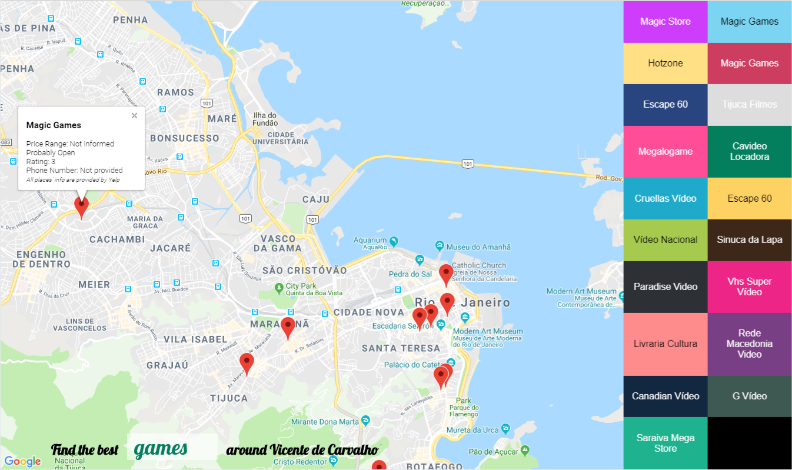

# Udacity's Advanced Front-End Final Project: Neighbourhood App

## Check it out!
https://andreaweb.github.io/neighbourhood-map/

## Install and Run

* Install dependencies with `npm install`
* Run the project with `npm start`

## What this is

* A React project that uses Google Maps' and Yelp's API's
* It shows businesses around a specific location (Vicente de Carvalho, Rio de Janeiro, Brazil)
* It shows coffee places by default but you may search other businesses
* You cannot, however, choose a different location
* The project is responsive, accessible, and works partially offline

